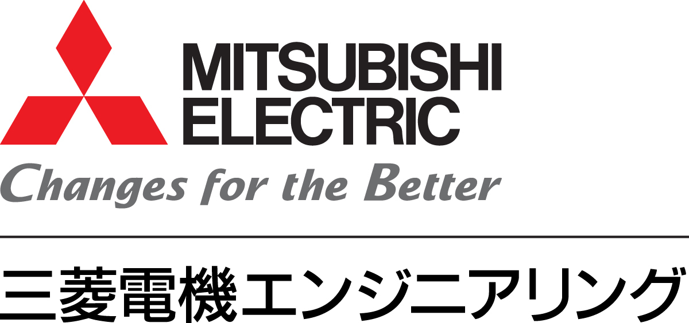

<div markdown="1" align="center">
  <h1>Generative AI Use Cases (GenU)</h1>

[](https://aws-samples.github.io/generative-ai-use-cases/index.html) [](https://github.com/aws-samples/generative-ai-use-cases/blob/main/LICENSE) [](https://github.com/aws-samples/generative-ai-use-cases/actions/workflows/node.js.yml) [](https://github.com/aws-samples/generative-ai-use-cases/actions/workflows/browser-extension.yml)

[English](./README.md) | [日本語](./README_ja.md) | 한국어

비즈니스 운영에서 생성형 AI를 활용하기 위한 비즈니스 사용 사례가 포함된 Well-architected 애플리케이션 구현

  
</div>

> [!IMPORTANT]
> GenU는 v4부터 다국어를 지원합니다.
>
> GenU has supported multiple languages since v4.
>
> GenU は v4 から多言語対応しました。일본어 문서는 [여기](./README_ja.md)를 참조하세요.

## GenU 사용 패턴

여기서는 사용 패턴별로 GenU의 기능과 옵션을 소개합니다. 포괄적인 배포 옵션은 [이 문서](docs/en/DEPLOY_OPTION.md)를 참조하세요.

> [!TIP]
> 사용 패턴을 클릭하면 세부 정보를 볼 수 있습니다

<details markdown="1">
  <summary><strong><ins>생성형 AI 사용 사례를 경험하고 싶습니다</ins></strong></summary>

GenU는 생성형 AI를 활용한 다양한 표준 사용 사례를 제공합니다. 이러한 사용 사례는 비즈니스 운영에서 생성형 AI를 활용하는 방법에 대한 아이디어의 씨앗 역할을 하거나, 그대로 비즈니스에 직접 적용할 수 있습니다. 앞으로도 더욱 정교한 사용 사례를 지속적으로 추가할 예정입니다. 불필요한 경우 옵션으로 [특정 사용 사례를 숨길](docs/en/DEPLOY_OPTION.md#hiding-specific-use-cases) 수도 있습니다. 다음은 기본적으로 제공되는 사용 사례입니다.

  <br/>
  <br/>
  <table width="100%">
    <thead>
      <tr>
        <td width="20%">사용 사례</td>
        <td width="80%">설명</td>
      </tr>
    </thead>
    <tbody>
      <tr>
        <td>채팅</td>
        <td>대화형 언어 모델(LLM)과 채팅 형식으로 상호작용할 수 있습니다. LLM과 직접 대화할 수 있는 플랫폼의 존재는 특정하고 새로운 사용 사례에 대한 빠른 응답을 가능하게 합니다. 프롬프트 엔지니어링을 위한 테스트 환경으로도 효과적입니다.</td>
      </tr>
      <tr>
        <td>텍스트 생성</td>
        <td>모든 맥락에서 텍스트를 생성하는 것은 LLM이 뛰어난 작업 중 하나입니다. 기사, 보고서, 이메일을 포함한 모든 종류의 텍스트를 생성합니다.</td>
      </tr>
      <tr>
        <td>요약</td>
        <td>LLM은 대량의 텍스트를 요약하는 데 뛰어납니다. 단순한 요약을 넘어서, 텍스트를 맥락으로 제공한 후 대화형 형식으로 필요한 정보를 추출할 수도 있습니다. 예를 들어, 계약서를 읽은 후 "XXX의 조건은 무엇인가요?" 또는 "YYY의 금액은 얼마인가요?"와 같은 질문을 할 수 있습니다.</td>
      </tr>
      <tr>
        <td>회의록</td>
        <td>오디오 녹음이나 실시간 전사에서 회의록을 자동으로 생성합니다. 프롬프트 엔지니어링 없이도 전사, 신문, FAQ 스타일 중에서 선택할 수 있습니다.</td>
      </tr>
      <tr>
        <td>글쓰기</td>
        <td>LLM은 오타뿐만 아니라 텍스트의 흐름과 내용을 고려하여 더 객관적인 관점에서 개선 사항을 제안할 수 있습니다. 다른 사람에게 작업을 보여주기 전에 놓칠 수 있는 부분을 LLM이 객관적으로 확인하여 품질 향상을 기대할 수 있습니다.</td>
      </tr>
      <tr>
        <td>번역</td>
        <td>다국어로 훈련된 LLM은 번역을 수행할 수 있습니다. 단순한 번역을 넘어서, 캐주얼함과 대상 독자와 같은 다양한 지정된 맥락 정보를 번역에 통합할 수 있습니다.</td>
      </tr>
      <tr>
        <td>웹 콘텐츠 추출</td>
        <td>블로그와 문서와 같은 웹 콘텐츠에서 필요한 정보를 추출합니다. LLM은 불필요한 정보를 제거하고 잘 구조화된 텍스트로 형식을 지정합니다. 추출된 콘텐츠는 요약 및 번역과 같은 다른 사용 사례에서 사용할 수 있습니다.</td>
      </tr>
      <tr>
        <td>이미지 생성</td>
        <td>이미지 생성 AI는 텍스트나 기존 이미지를 기반으로 새로운 이미지를 생성할 수 있습니다. 아이디어의 즉각적인 시각화를 가능하게 하여 디자인 작업의 효율성을 향상시킬 수 있습니다. 이 기능에서 LLM은 프롬프트 생성을 도울 수 있습니다.</td>
      </tr>
      <tr>
        <td>비디오 생성</td>
        <td>비디오 생성 AI는 텍스트에서 짧은 비디오를 생성합니다. 생성된 비디오는 다양한 시나리오에서 자료로 사용할 수 있습니다.</td>
      </tr>
      <tr>
        <td>비디오 분석</td>
        <td>멀티모달 모델을 통해 이제 텍스트뿐만 아니라 이미지도 입력할 수 있습니다. 이 기능에서는 LLM에게 비디오 프레임과 텍스트 입력을 분석하도록 요청할 수 있습니다.</td>
      </tr>
      <tr>
        <td>다이어그램 생성</td>
        <td>다이어그램 생성은 최적의 다이어그램을 사용하여 모든 주제의 텍스트와 콘텐츠를 시각화합니다. 쉬운 텍스트 기반 다이어그램 생성을 가능하게 하여 프로그래머나 디자이너가 아니어도 효율적으로 플로우차트 및 기타 다이어그램을 생성할 수 있습니다.</td>
      </tr>
      <tr>
        <td>음성 채팅</td>
        <td>음성 채팅에서는 생성형 AI와 양방향 음성 채팅을 할 수 있습니다. 자연스러운 대화와 유사하게, AI가 말하는 동안 중단하고 말할 수도 있습니다. 또한 시스템 프롬프트를 설정하여 특정 역할을 가진 AI와 음성 대화를 할 수 있습니다.</td>
      </tr>
    </tbody>
  </table>
</details>

<details markdown="1">
  <summary><strong><ins>RAG를 하고 싶습니다</ins></strong></summary>

RAG는 LLM이 일반적으로 어려워하는 외부의 최신 정보나 도메인 지식을 제공하여 LLM이 평소에는 답할 수 없는 질문에 답할 수 있게 하는 기술입니다.
조직 내에 축적된 PDF, Word, Excel 및 기타 파일들이 정보 소스 역할을 할 수 있습니다.
RAG는 또한 증거에 기반한 답변만을 허용함으로써 LLM이 "그럴듯하지만 잘못된 정보"를 제공하는 것을 방지하는 효과가 있습니다.

GenU는 RAG Chat 사용 사례를 제공합니다.
RAG Chat에는 두 가지 유형의 정보 소스를 사용할 수 있습니다: [Amazon Kendra](docs/en/DEPLOY_OPTION.md)와 [Knowledge Base](docs/en/DEPLOY_OPTION.md#enabling-rag-chat-knowledge-base-use-case).
Amazon Kendra를 사용할 때는 [수동으로 생성된 S3 버킷이나 Kendra 인덱스를 그대로 사용](docs/en/DEPLOY_OPTION.md#using-an-existing-amazon-kendra-index)할 수 있습니다.
Knowledge Base를 사용할 때는 [고급 파싱](docs/en/DEPLOY_OPTION.md#enabling-advanced-parsing), [청크 전략 선택](docs/en/DEPLOY_OPTION.md#changing-chunking-strategy), [쿼리 분해](docs/en/DEPLOY_OPTION.md#enabling-rag-chat-knowledge-base-use-case), [재순위](docs/en/DEPLOY_OPTION.md#enabling-rag-chat-knowledge-base-use-case)와 같은 고급 RAG 기능을 사용할 수 있습니다.
Knowledge Base는 또한 [메타데이터 필터 설정](docs/en/DEPLOY_OPTION.md#metadata-filter-configuration)을 허용합니다.
예를 들어, "조직별로 접근 가능한 데이터 소스 전환" 또는 "사용자가 UI에서 필터를 설정할 수 있도록 허용"과 같은 요구사항을 충족할 수 있습니다.

또한 [MCP 채팅을 활성화](docs/en/DEPLOY_OPTION.md#enabling-mcp-chat-use-case)하고 외부 서비스의 MCP 서버를 [packages/cdk/mcp-api/mcp.json](/packages/cdk/mcp-api/mcp.json)에 추가하여 AWS 외부의 데이터를 참조하는 RAG를 구축할 수 있습니다.

</details>

<details markdown="1">
  <summary><strong><ins>조직 내에서 사용자 정의 Bedrock Agents 또는 Bedrock Flows를 사용하고 싶습니다</ins></strong></summary>

GenU에서 [에이전트를 활성화](docs/en/DEPLOY_OPTION.md#enabling-agent-chat-use-case)하면 웹 검색 에이전트와 코드 인터프리터 에이전트가 생성됩니다.
웹 검색 에이전트는 사용자 질문에 답하기 위해 웹에서 정보를 검색합니다. 예를 들어, "AWS GenU란 무엇인가요?"에 답할 수 있습니다.
코드 인터프리터 에이전트는 사용자 요청에 응답하기 위해 코드를 실행할 수 있습니다. 예를 들어, "더미 데이터로 산점도를 그려주세요"와 같은 요청에 응답할 수 있습니다.

웹 검색 에이전트와 코드 인터프리터 에이전트는 기본적인 에이전트이지만, 비즈니스 요구에 맞춘 더 실용적인 에이전트를 사용하고 싶을 수 있습니다.
GenU는 수동으로 생성했거나 다른 자산으로 생성한 [에이전트를 가져오는](docs/en/DEPLOY_OPTION.md#adding-manually-created-agents) 기능을 제공합니다.

GenU를 에이전트 활용 플랫폼으로 사용하면 GenU의 [풍부한 보안 옵션](docs/en/DEPLOY_OPTION.md#security-related-settings)과 [SAML 인증](docs/en/DEPLOY_OPTION.md#saml-authentication)을 활용하여 조직 내에 실용적인 에이전트를 확산시킬 수 있습니다.
또한 [불필요한 표준 사용 사례를 숨기거나](docs/en/DEPLOY_OPTION.md#hiding-specific-use-cases) [에이전트를 인라인으로 표시](docs/en/DEPLOY_OPTION.md#displaying-agents-inline)하여 GenU를 더 에이전트 중심의 플랫폼으로 사용할 수 있습니다.

마찬가지로 Bedrock Flows에 대한 [가져오기 기능](docs/en/DEPLOY_OPTION.md#enabling-flow-chat-use-case)이 있으므로 활용해 주세요.

또한 [MCP 채팅을 활성화](docs/en/DEPLOY_OPTION.md#enabling-mcp-chat-use-case)하고 외부 MCP 서버를 [packages/cdk/mcp-api/mcp.json](/packages/cdk/mcp-api/mcp.json)에 추가하여 AWS 외부 서비스에서 작업을 수행하는 에이전트를 생성할 수 있습니다.

</details>

<details markdown="1">
  <summary><strong><ins>사용자 정의 사용 사례를 생성하고 싶습니다</ins></strong></summary>

GenU는 자연어로 프롬프트 템플릿을 설명하여 사용자 정의 사용 사례를 생성할 수 있는 "Use Case Builder"라는 기능을 제공합니다.
프롬프트 템플릿만으로 사용자 정의 사용 사례 화면이 자동으로 생성되므로 GenU 자체에 대한 코드 변경이 필요하지 않습니다.
생성된 사용 사례는 개인용이 아닌 애플리케이션에 로그인할 수 있는 모든 사용자와 공유할 수 있습니다.
Use Case Builder는 필요하지 않은 경우 [비활성화](docs/en/DEPLOY_OPTION.md#use-case-builder-configuration)할 수 있습니다.
사용 사례는 .json 파일로 내보내어 제3자와 공유할 수도 있습니다. 사용 사례를 공유할 때는 프롬프트나 사용 예제에 기밀 정보가 포함되지 않도록 주의하세요. 제3자가 공유한 사용 사례는 새 사용 사례 생성 화면에서 .json 파일을 업로드하여 가져올 수 있습니다.
Use Case Builder에 대한 자세한 내용은 <a href="https://aws.amazon.com/jp/blogs/news/genu-use-cases-builder/">이 블로그</a>를 확인하세요.
<br/>
<br/>
Use Case Builder는 텍스트를 양식에 입력하거나 파일을 첨부하는 사용 사례를 생성할 수 있지만, 요구사항에 따라 채팅 UI가 더 적합할 수 있습니다.
그런 경우에는 "채팅" 사용 사례의 시스템 프롬프트 저장 기능을 활용하세요.
시스템 프롬프트를 저장하면 한 번의 클릭으로 비즈니스에 필요한 "봇"을 생성할 수 있습니다.
예를 들어, "입력된 소스 코드를 철저히 검토하는 봇" 또는 "입력 내용에서 이메일 주소를 추출하는 봇"을 생성할 수 있습니다.
또한 채팅 대화 기록은 로그인한 사용자와 공유할 수 있으며, 공유된 대화 기록에서 시스템 프롬프트를 가져올 수 있습니다.
<br/>
<br/>
GenU는 OSS이므로 자체 사용 사례를 추가하도록 사용자 정의할 수도 있습니다.
그런 경우에는 GenU의 메인 브랜치와의 충돌에 주의하세요.

</details>

## 배포

> [!IMPORTANT]
> [`/packages/cdk/cdk.json`](/packages/cdk/cdk.json)에 나열된 `modelRegion` 지역에서 `modelIds`(텍스트 생성), `imageGenerationModelIds`(이미지 생성), `videoGenerationModelIds`(비디오 생성)를 활성화하세요. ([Amazon Bedrock 모델 액세스 화면](https://us-east-1.console.aws.amazon.com/bedrock/home?region=us-east-1#/modelaccess))

GenU 배포는 [AWS Cloud Development Kit](https://aws.amazon.com/jp/cdk/) (CDK)를 사용합니다. CDK 실행 환경을 준비할 수 없는 경우 다음 배포 방법을 참조하세요:

- [AWS CloudShell을 사용한 배포 방법 (자체 환경 준비가 어려운 경우)](docs/en/DEPLOY_ON_CLOUDSHELL.md)
- 워크샵 ([영어](https://catalog.workshops.aws/generative-ai-use-cases) / [일본어](https://catalog.workshops.aws/generative-ai-use-cases-jp))

먼저 다음 명령을 실행하세요. 모든 명령은 저장소 루트에서 실행해야 합니다.

```bash
npm ci
```

CDK를 처음 사용하는 경우 처음에만 [Bootstrap](https://docs.aws.amazon.com/ja_jp/cdk/v2/guide/bootstrapping.html)이 필요합니다. 환경이 이미 부트스트랩된 경우 다음 명령은 불필요합니다.

```bash
npx -w packages/cdk cdk bootstrap
```

다음으로, 다음 명령으로 AWS 리소스를 배포하세요. 배포가 완료될 때까지 기다리세요(약 20분 소요될 수 있습니다).

```bash
# 일반 배포
npm run cdk:deploy

# 빠른 배포 (생성된 리소스를 사전 확인하지 않고 빠르게 배포)
npm run cdk:deploy:quick
```

## 아키텍처


## 기타 정보

- [배포 옵션](docs/en/DEPLOY_OPTION.md)
- [업데이트 방법](docs/en/UPDATE.md)
- [로컬 개발 환경 설정](docs/en/DEVELOPMENT.md)
- [리소스 삭제 방법](docs/en/DESTROY.md)
- [네이티브 앱으로 사용하는 방법](docs/en/PWA.md)
- [브라우저 확장 프로그램 사용](docs/en/EXTENSION.md)

## 비용 추정

GenU 사용을 위한 구성 및 비용 추정 예제를 게시했습니다. (서비스는 사용한 만큼 지불하는 방식이며, 실제 비용은 사용량에 따라 달라집니다.)

- [간단한 버전 (RAG 없음) 추정](https://aws.amazon.com/jp/cdp/ai-chatbot/)
- [RAG 포함 (Amazon Kendra) 추정](https://aws.amazon.com/jp/cdp/ai-chatapp/)
- [RAG 포함 (Knowledge Base) 추정](https://aws.amazon.com/jp/cdp/genai-chat-app/)
## 고객 사례 연구

| 고객                                                                                                                          | 인용문                                                                                                                                                                                                                                                                                                                                                                                                                                                                                                                                                      |
| :-------------------------------------------------------------------------------------------------------------------------------- | :--------------------------------------------------------------------------------------------------------------------------------------------------------------------------------------------------------------------------------------------------------------------------------------------------------------------------------------------------------------------------------------------------------------------------------------------------------------------------------------------------------------------------------------------------------- |
| <a href="https://www.yasashiite.com/" target="_blank"></a>              | **Yasashiite Co., Ltd.** <br/> _GenU 덕분에 사용자에게 부가가치를 제공하고 직원의 업무 효율성을 향상시킬 수 있었습니다. 직원들의 "이전 업무"가 즐거운 업무로 변화하면서 "원활한 운영"에서 "흥미진진한 업무"로 계속 발전하고 있습니다!_ <br/> ・[사례 세부사항 보기](./docs/assets/images/cases/yasashiite_case.png) <br/> ・[사례 페이지 보기](https://aws.amazon.com/jp/solutions/case-studies/yasashii-te/)                                                                                                                       |
| <a href="https://www.takihyo.co.jp/" target="_blank"></a>                  | **TAKIHYO Co., Ltd.** <br/> _생성형 AI를 활용하여 내부 비즈니스 효율성을 달성하고 450시간 이상의 업무를 단축했습니다. Amazon Bedrock을 의류 디자인 등에 적용하고 디지털 인재 개발을 촉진했습니다._ <br/> ・[사례 페이지 보기](https://aws.amazon.com/jp/solutions/case-studies/takihyo/)                                                                                                                                                                                                                                            |
| <a href="https://salsonido.com/" target="_blank"></a>                    | **Salsonido Inc.** <br/> _솔루션으로 제공되는 GenU를 활용하여 생성형 AI로 비즈니스 프로세스 개선을 빠르게 시작할 수 있었습니다._ <br/> ・[사례 세부사항 보기](./docs/assets/images/cases/salsonido_case.png) <br/> ・[적용 서비스](https://kirei.ai/)                                                                                                                                                                                                                                                                                       |
| <a href="https://www.tamura-ss.co.jp/jp/index.html" target="_blank"></a> | **TAMURA CORPORATION** <br/> _AWS가 Github에 게시하는 애플리케이션 샘플에는 즉시 테스트할 수 있는 기능이 풍부하며, 그대로 사용하여 우리에게 적합한 기능을 쉽게 선택하고 최종 시스템의 개발 시간을 단축할 수 있었습니다._<br/> ・[사례 세부사항 보기](./docs/assets/images/cases/tamura-ss_case.png)<br/>                                                                                                                                                                                                                                             |
| <a href="https://jdsc.ai/" target="_blank"></a>                               | **JDSC Inc.** <br/> _Amazon Bedrock을 통해 우리 데이터로 LLM을 안전하게 사용할 수 있습니다. 또한 목적에 따라 최적의 모델로 전환할 수 있어 비용을 절약하면서 속도와 정확성을 향상시킬 수 있습니다._ <br/> ・[사례 세부사항 보기](./docs/assets/images/cases/jdsc_case.png)                                                                                                                                                                                                                                                                             |
| <a href="https://www.iret.co.jp/" target="_blank"></a>                        | **iret, Inc.** <br/> _BANDAI NAMCO Amusement Inc.의 생성형 AI 활용을 위한 내부 지식을 축적하고 체계화하기 위해 AWS에서 제공하는 Generative AI Use Cases JP를 사용하여 사용 사례 사이트를 개발했습니다. iret, Inc.는 이 프로젝트의 설계, 구축 및 개발을 지원했습니다._ <br/> ・[BANDAI NAMCO Amusement Inc.의 클라우드 활용 사례 연구](https://cloudpack.jp/casestudy/302.html?_gl=1*17hkazh*_gcl_au*ODA5MDk3NzI0LjE3MTM0MTQ2MDU)                                                                                        |
| <a href="https://idealog.co.jp" target="_blank"></a>                       | **IDEALOG Inc.** <br/> _기존 생성형 AI 도구보다 훨씬 더 큰 업무 효율성을 달성할 수 있다고 느낍니다. 입력/출력 데이터를 모델 훈련에 사용하지 않는 Amazon Bedrock을 사용하면 보안 측면에서 안심할 수 있습니다._ <br/> ・[사례 세부사항 보기](./docs/assets/images/cases/idealog_case.png) <br/> ・[적용 서비스](https://kaijosearch.com/)                                                                                                                                                                                          |
| <a href="https://estyle.co.jp/" target="_blank"></a>                        | **eStyle Inc.** <br/> _GenU를 활용하여 짧은 기간에 생성형 AI 환경을 구축하고 회사 내 지식 공유를 촉진할 수 있었습니다._ <br/> ・[사례 세부사항 보기](./docs/assets/images/cases/estyle_case.png)                                                                                                                                                                                                                                                                                                                                                    |
| <a href="https://meidensha.co.jp/" target="_blank"></a>                  | **Meidensha Corporation** <br/> _Amazon Bedrock과 Amazon Kendra와 같은 AWS 서비스를 사용하여 빠르고 안전하게 생성형 AI 사용 환경을 구축할 수 있었습니다. 회의록 자동 생성과 내부 정보 검색을 통해 직원의 업무 효율성에 기여합니다._ <br/> ・[사례 세부사항 보기](./docs/assets/images/cases/meidensha_case.png)                                                                                                                                                                                                                                                   |
| <a href="https://www.st-grp.co.jp/" target="_blank"></a>                    | **Sankyo Tateyama, Inc.** <br/> _회사 내에 묻혀있던 정보가 Amazon Kendra로 빠르게 검색 가능해졌습니다. GenU를 참조하여 회의록 생성과 같이 필요한 기능을 신속하게 제공할 수 있었습니다._ <br/> ・[사례 세부사항 보기](./docs/assets/images/cases/st-grp_case.png)                                                                                                                                                                                                                                                                           |
| <a href="https://www.oisixradaichi.co.jp/" target="_blank"></a>      | **Oisix ra daichi Inc.** <br/> _GenU를 사용한 사용 사례 개발 프로젝트를 통해 필요한 리소스, 프로젝트 구조, 외부 지원 및 인재 개발을 파악할 수 있었고, 이는 생성형 AI의 내부 배포에 대한 이미지를 명확히 하는 데 도움이 되었습니다._ <br/> ・[사례 페이지 보기](https://aws.amazon.com/jp/solutions/case-studies/oisix/)                                                                                                                                                                                         |
| <a href="https://www.san-a.co.jp/" target="_blank"></a>                      | **SAN-A CO., LTD.** <br/> _Amazon Bedrock을 활용하여 엔지니어의 생산성이 극적으로 향상되어 사내에서 구축한 회사별 환경의 클라우드 마이그레이션이 가속화되었습니다._ <br/> ・[사례 세부사항 보기](./docs/assets/images/cases/san-a_case.png)<br/> ・[사례 페이지 보기](https://aws.amazon.com/jp/solutions/case-studies/san-a/)                                                                                                                                                                                           |
| <a href="https://onecompath.com/" target="_blank"></a>                  | **ONE COMPATH CO., LTD.** <br/> _GenU를 활용하여 회사 전체의 생성형 AI 기반을 빠르게 구축할 수 있었습니다. 이를 통해 기획 부서가 독립적으로 PoC를 개발할 수 있게 되어 비즈니스 창출 사이클이 가속화되고 개발 부서가 더 중요한 비즈니스 이니셔티브에 리소스를 집중할 수 있게 되었습니다._ <br/> ・[사례 세부사항 보기](./docs/assets/images/cases/onecompath_case.png)<br/>                                                                                                     |
| <a href="https://www.mee.co.jp/" target="_blank"></a>                          | **Mitsubishi Electric Engineering CO., LTD.** <br/> _생성형 AI 개발 경험이 없는 팀 멤버들이 ServerWorks의 지도하에 GenU를 사용하여 단 3개월 만에 RAG 시스템을 성공적으로 구축했습니다. GenU의 아키텍처를 참조로 활용하여 헬프데스크 매뉴얼 검색 작업의 효율성 향상을 달성하고 사내 개발 역량을 실현했습니다._ <br/> ・[사례 세부사항 보기](https://www.serverworks.co.jp/case/mee.html?utm_source=github&utm_medium=external-media&utm_campaign=github_external-media_GenU)<br/> |

사용 사례를 소개하고 싶으시면 [Issue](https://github.com/aws-samples/generative-ai-use-cases/issues)를 통해 연락해 주세요.
## 참고 자료

- [GitHub (일본어): 원클릭으로 GenU를 배포하는 방법](https://github.com/aws-samples/sample-one-click-generative-ai-solutions)
- [블로그 (일본어): 코드 없이 생성형 AI 앱을 생성하고 배포하는 GenU Use Case Builder](https://aws.amazon.com/jp/blogs/news/genu-use-cases-builder/)
- [블로그 (일본어): RAG 프로젝트를 성공시키는 방법 #1 ~ 또는 빠르게 실패하는 방법 ~](https://aws.amazon.com/jp/builders-flash/202502/way-to-succeed-rag-project/)
- [블로그 (일본어): RAG Chat에서 정확도를 향상시키는 디버깅 방법](https://qiita.com/sugimount-a/items/7ed3c5fc1eb867e28566)
- [블로그 (일본어): Amazon Q Developer CLI를 사용하여 코딩 없이 GenU 사용자 정의하기](https://qiita.com/wadabee/items/659e189018ad1a08e152)
- [블로그 (일본어): Generative AI Use Cases JP를 사용자 정의하는 방법](https://aws.amazon.com/jp/blogs/news/how-to-generative-ai-use-cases-jp/)
- [블로그 (일본어): Generative AI Use Cases JP ~ 첫 기여 가이드](https://aws.amazon.com/jp/builders-flash/202504/genu-development-guide/)
- [블로그 (일본어): 생성형 AI가 무리한 요청을 거절하게 하기 ~ 생성형 AI를 브라우저에 통합하기 ~](https://aws.amazon.com/jp/builders-flash/202405/genai-sorry-message/)
- [블로그 (일본어): Amazon Bedrock으로 인터프리터 개발하기!](https://aws.amazon.com/jp/builders-flash/202311/bedrock-interpreter/)
- [블로그 (일본어): 부서별 필터링을 위한 GenU의 메타데이터 필터 사용](https://qiita.com/sugimount-a/items/f08c1a7a777d5dece386)
- [블로그 (일본어): 다른 AWS 계정으로 GenU에서 Bedrock 추론 실행하기](https://qiita.com/sugimount-a/items/e7d2fb94abacebec40d1)
- [비디오 (일본어): 생성형 AI 사용 사례를 철저히 고려하기 위한 Generative AI Use Cases JP (GenU)의 매력과 사용법](https://www.youtube.com/live/s1P5A2SIWgc?si=PBQ4ZHQXU4pDhL8A)

## 보안

자세한 정보는 [CONTRIBUTING](/CONTRIBUTING.md#security-issue-notifications)을 참조하세요.

## 라이선스

이 라이브러리는 MIT-0 라이선스에 따라 라이선스가 부여됩니다. LICENSE 파일을 참조하세요.
